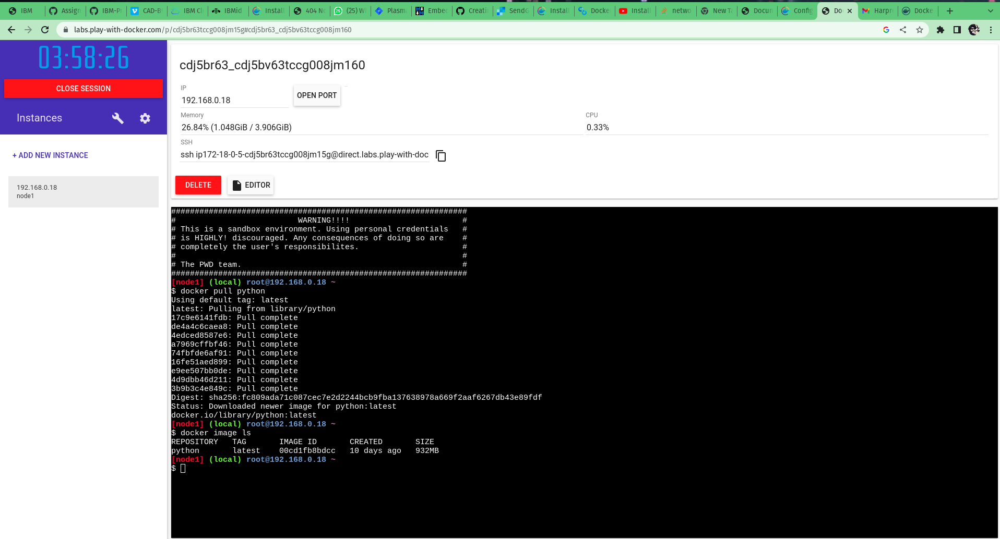
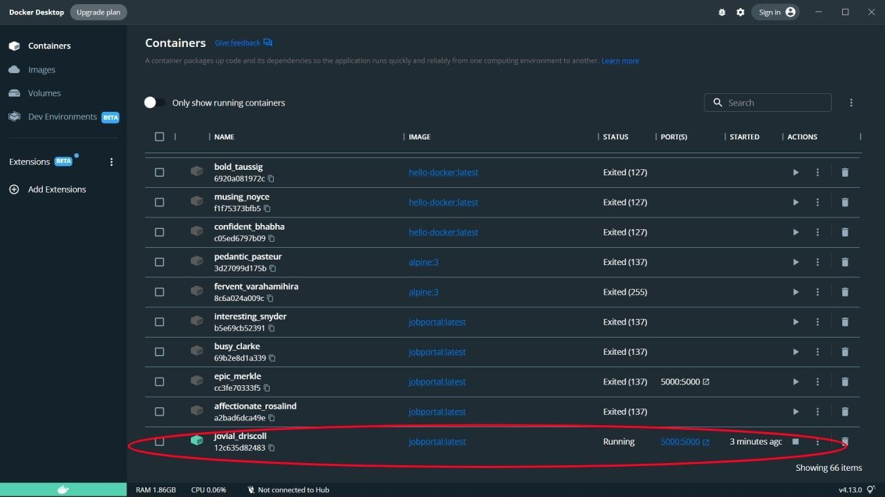
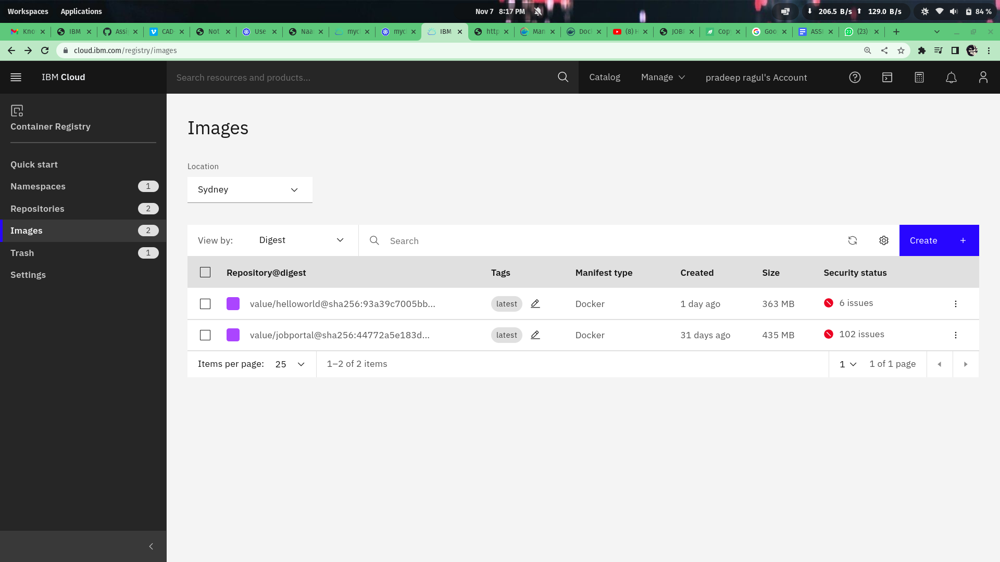
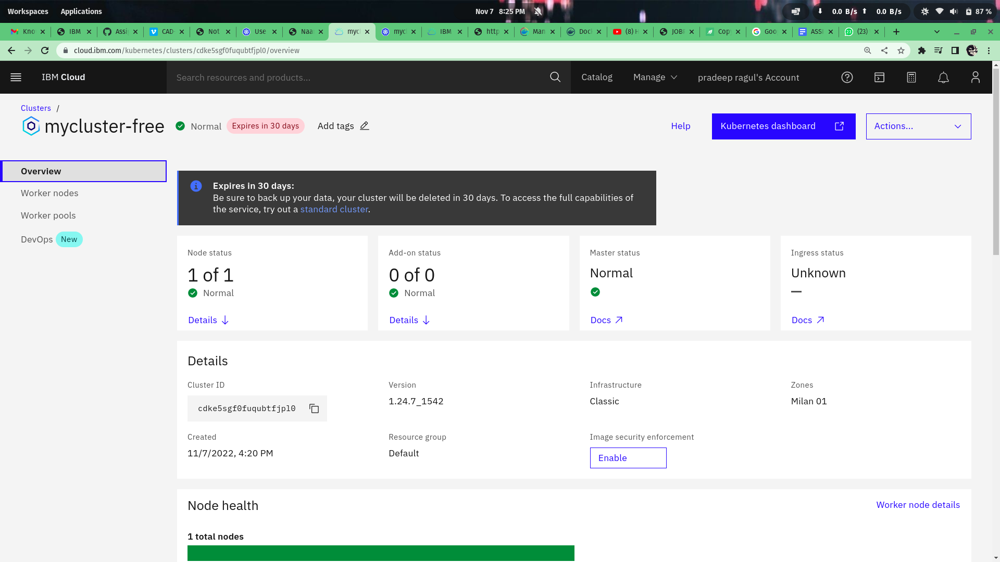
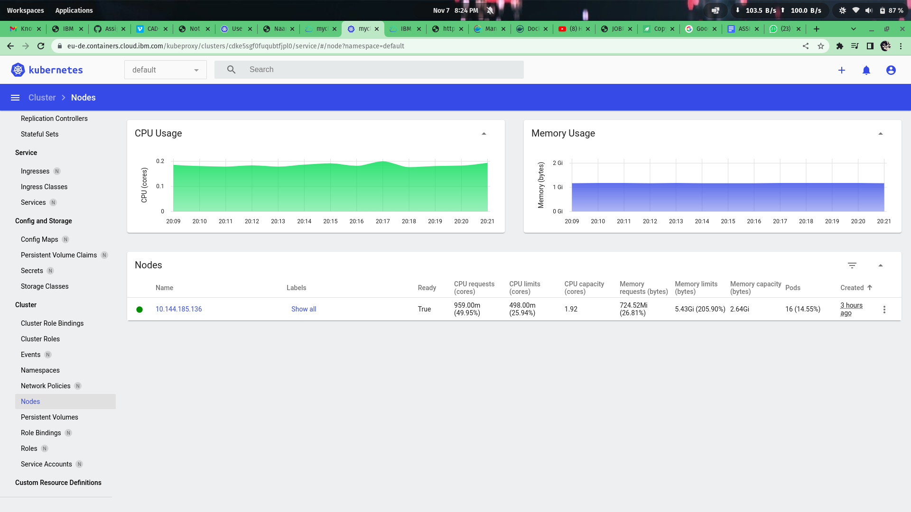

________
<h1 style="text-align:center"> <b>Assignment IV</b> </h1>


|||
|:---|:----|
|**Team ID** | **PNT2022TMID17680** |
|**Project Title**| **Plasma Donor Application**|
|**Date**|**21 October 2022**|
-------------------

## 1. Pull an Image from docker hub and run it in docker playground.
<br>


_______

## 2. Create a docker file for the jobportal application and deploy it in Docker desktop application.

[DockerFile](files/Dockerfile)

```
# Docker File

FROM python:3
COPY . /app
WORKDIR /app
RUN python3 -m pip install -r requirements.txt
EXPOSE 5000
CMD [ "python3","app.py" ]

```

_______________

## 3. Create a IBM container registry and deploy helloworld app or jobportalapp.



_________________

## 4. Create a IBM container registry and deploy helloworld app or jobportalapp.

[**Deployment.yaml**](files/deployment.yaml)
```
# Deployment.yaml file

apiVersion: apps/v1
kind: Deployment
metadata :
  name: jobportal
spec:
  replicas: 3
  selector:
    matchLabels :
      app: jobportal
  template:
    metadata:
      labels:
        app: jobportal
    spec:
      containers:
      - name: jobportal
        image : vasudeha/cadjob
        imagePullPolicy: Always
        ports:
        - containerPort: 5000
```
[**Sevice.yaml**](files/service.yaml)

```
# sevice.ymal file
apiVersion: v1
kind: Service
metadata:
  name : jobportal
spec:
  ports:
  - port: 5000
    # targetPort: 5000
  type: NodePort
  selector:
    app: jobportal

```


