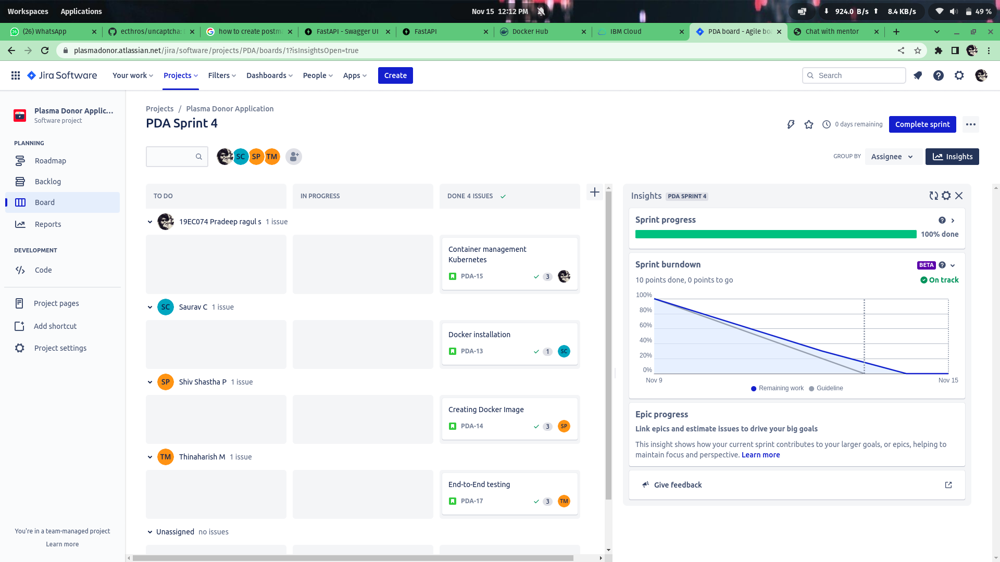
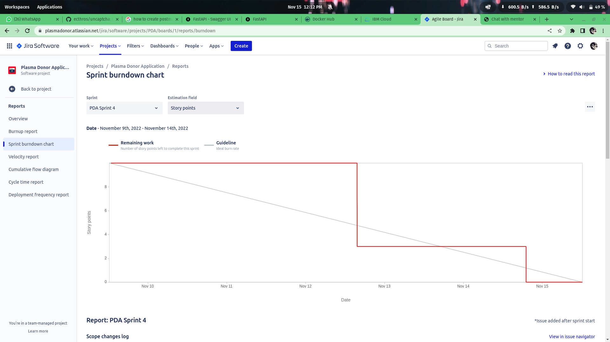

# Plasma Donor Application [[Project link]](http://159.122.187.202:31326/)


## **Link for our Project**
```
http://159.122.187.202:31326/
```


## Project Description:

During the COVID 19 crisis, the requirement of plasma became a high priority and the donor count has become low. Saving the donor information and helping the needy by notifying the current donors list, would be a helping hand. In regard to the problem faced, an application is to be built which would take the donor details, store them and inform them upon a request.


## LINK TO OUR PROJECT
```
http://159.122.187.202:31326/
```

## Our Workspace



## BurnDown.



## To Run this Applicaiton locally
    python app.py

## To pull my Docker Image.
    docker pull au.icr.io/value/pda:latest

## To make the changes in the production.
    make update-production
