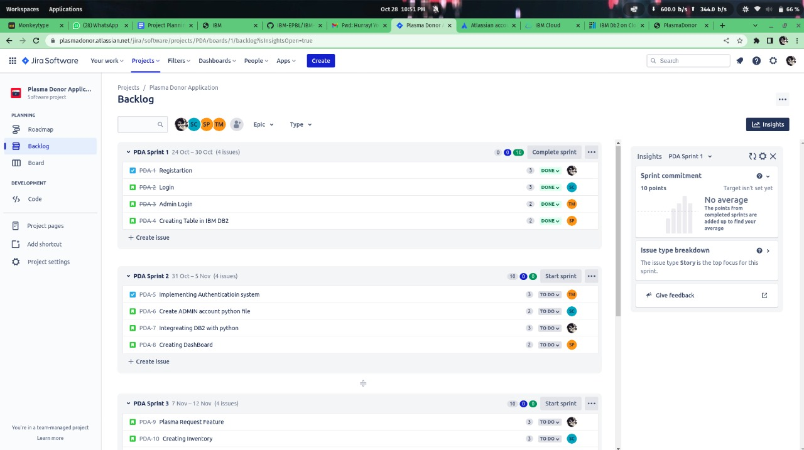
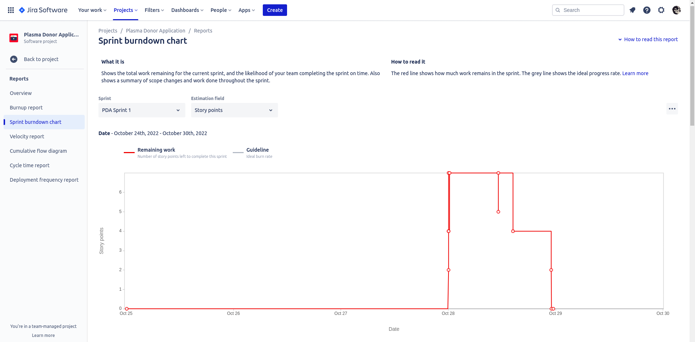
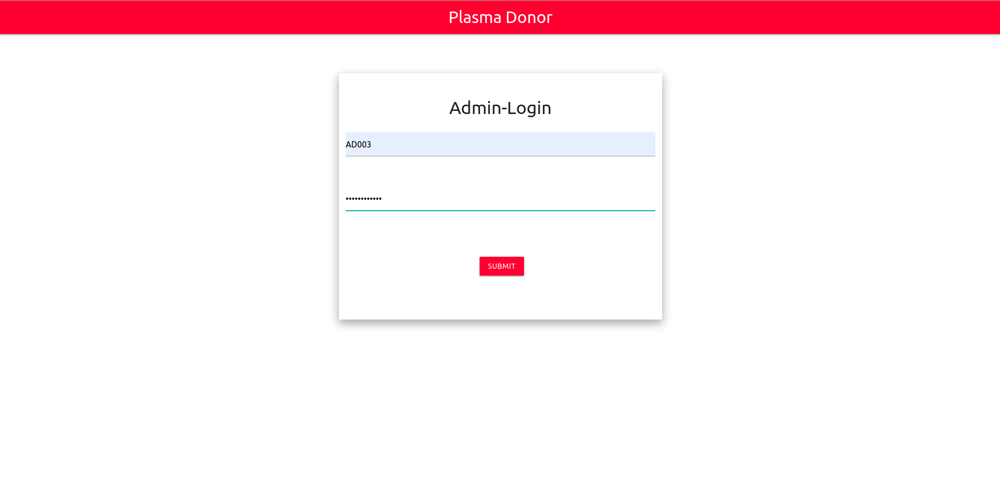
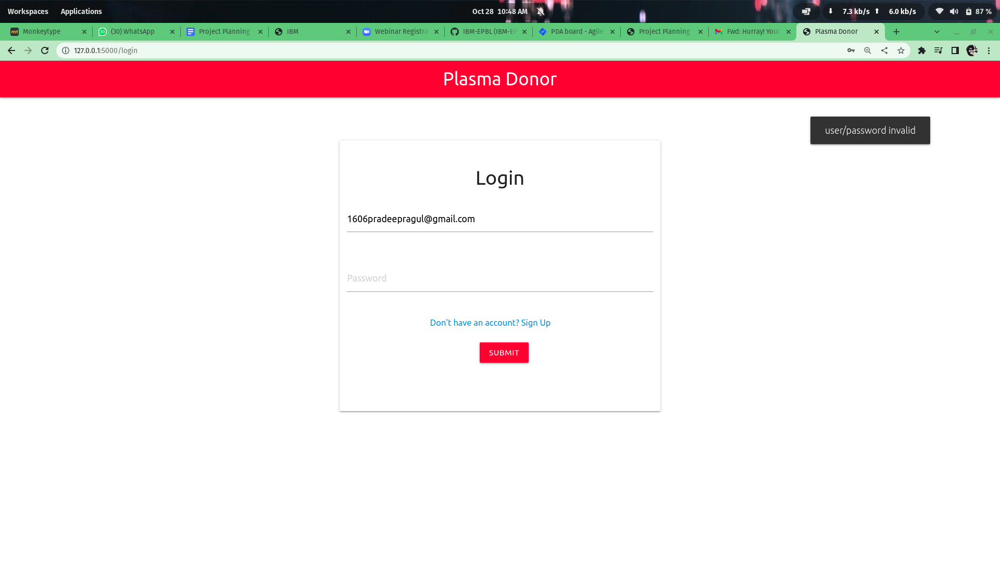
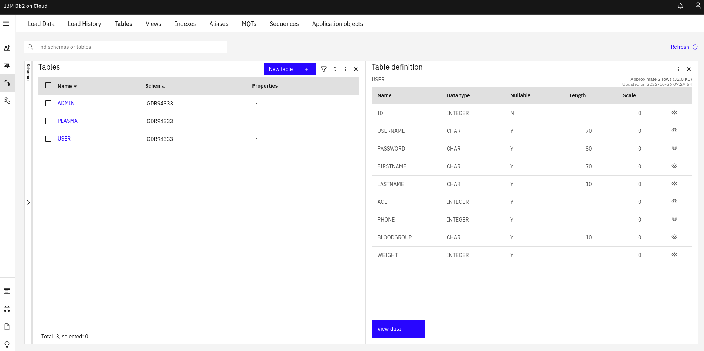
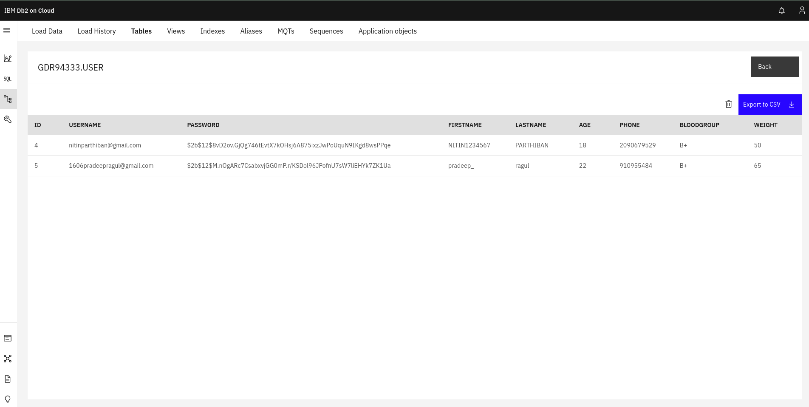

# Sprint 1

## Description
Here the WebApplication is under development stage, Here we have added features like.

    -Login Page
    -Register Page
    -Admin Login Page
    -Created Tables of IBM CLOUD
    -Tested the integeration of Clould DB2 via python.

## Our Workspace

## BurnDown.

## To Run this Applicaiton
    python app.py

## Some of the screen shots are:

|||
|:---:|:----:|
|||
|||