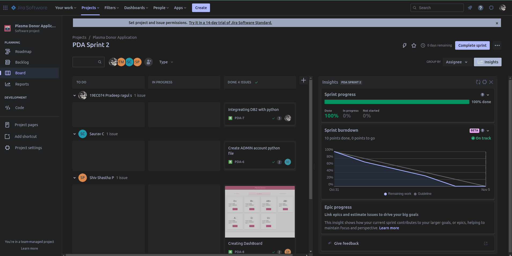
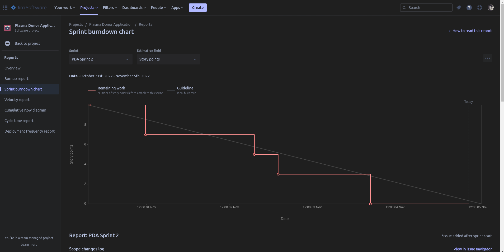
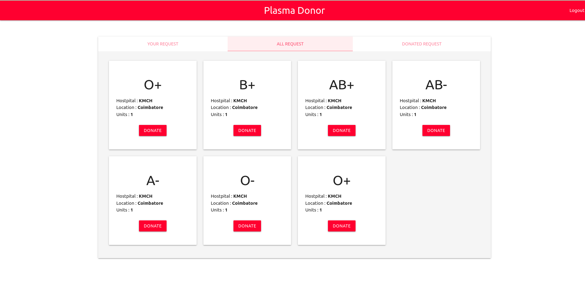
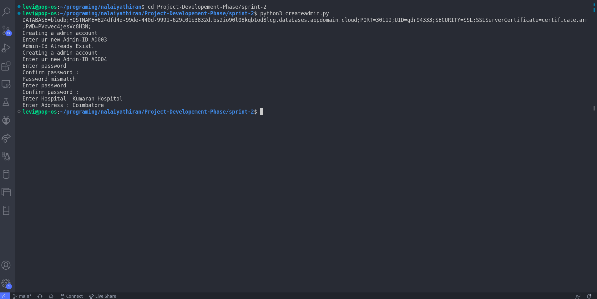
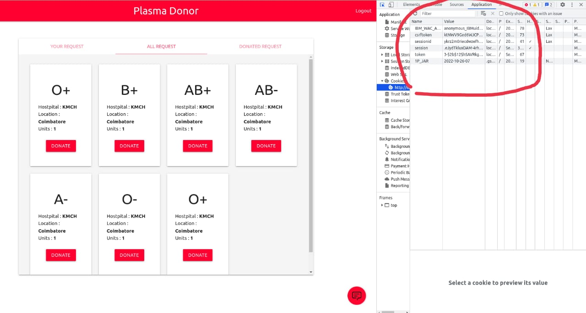
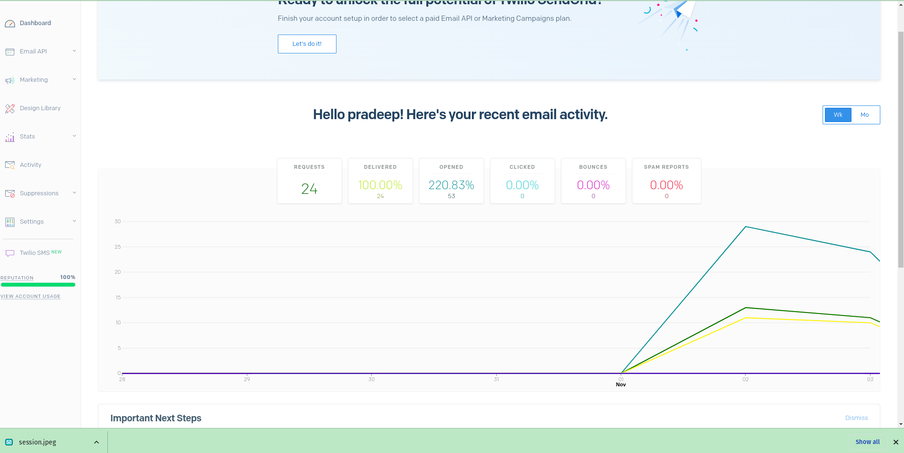

# Sprint 2

## Description
Here the WebApplication is under development stage, Here we have added features like.

- Creating DB2 connectivity with python
- Created an python file to create an admin ([createadmin.py](/Project-Developement-Phase/sprint-2/createadmin.py))
- Created a dashboard for user profile.
- Implemented Autentication systems for both user and admin login system with sessions and cookies.
- Tried to create an account on Sendgrid account.

## Our Workspace

## BurnDown.

## To Run this Applicaiton
    python app.py

## To create admin account
    python createadmin.py

## Some of the screen shots are:

|||
|:---:|:----:|
|||
|||