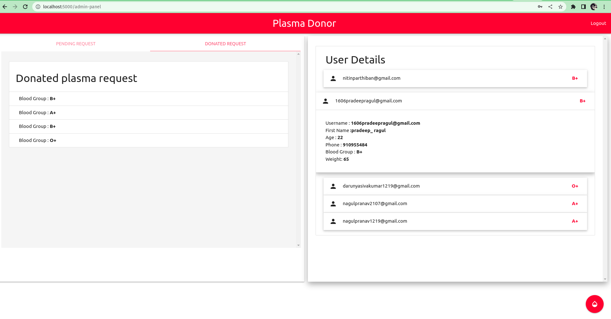

# Sprint 3

## Description
Here the WebApplication is under development stage, Here we have added features like.
- Created A Plasma request features in Admin Side.
- Integrated Sendgind Mail API into our [CURD.py](CURD.py) file.
- Created A Admin inventory UI which consist of
    1. All Users in the portal
    1. All The Donated List
    1. All The Recipient List.
    1. Creat Plasma Request form.
- Integrated Watson Chat Bot into user portal for user general query.

## Our Workspace

## BurnDown.

## To Run this Applicaiton
    python app.py

______
## **Features and ScreenShots**

### 1. Created A Plasma request features in Admin Side.

### 2. Created Admin-Inventory

### 3. Integrated Watson Chat Bot into user portal for user general query.

### 4. Integrated SendGrind Features

