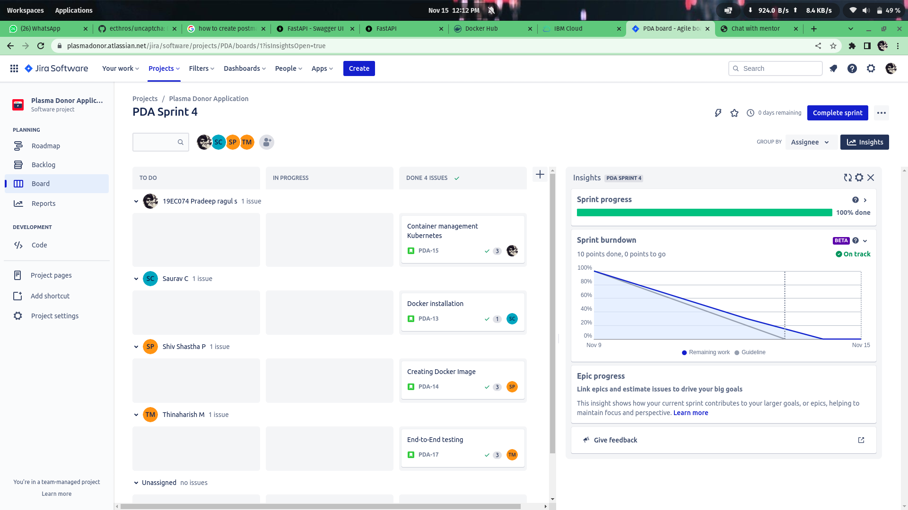
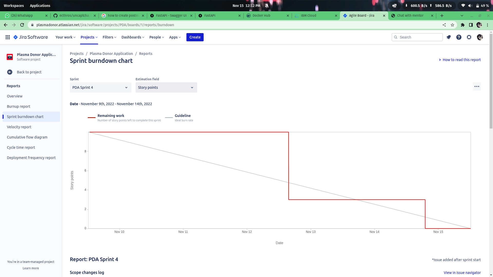
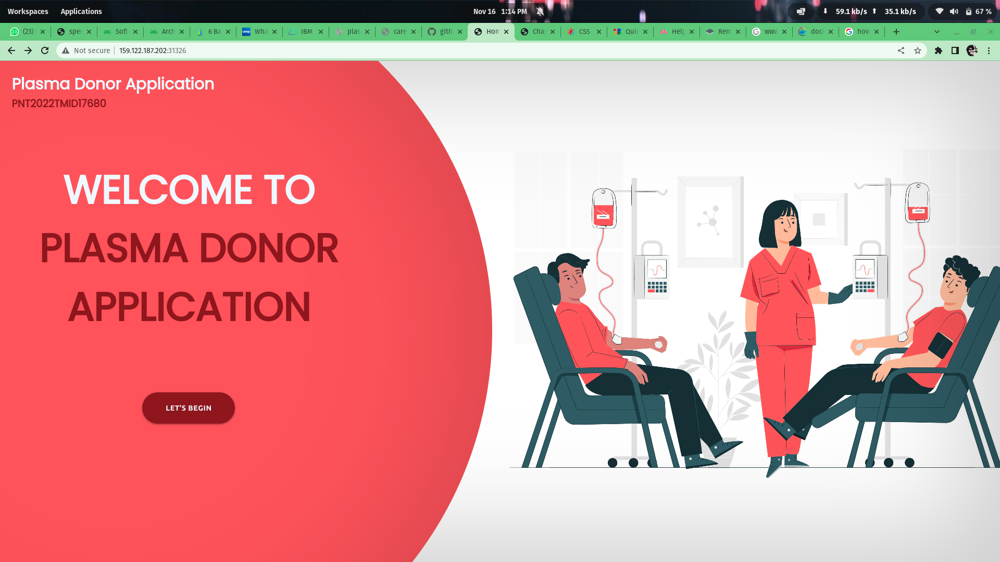
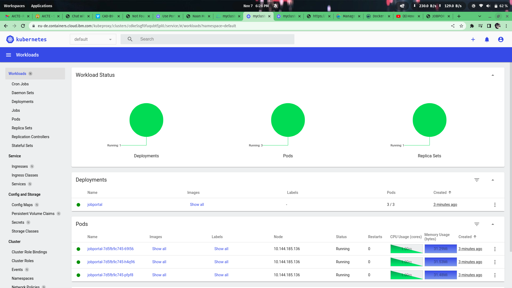
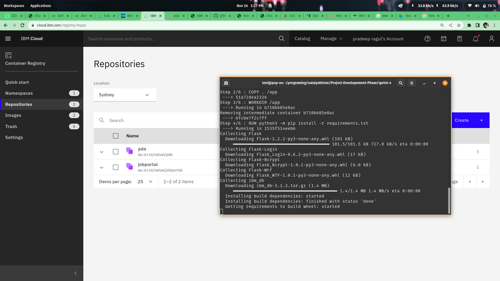
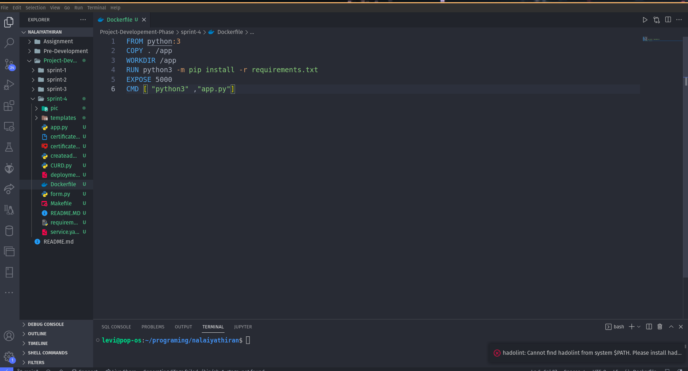

# Sprint 4

## Description
Here the WebApplication is under development stage, Here we have added features like.
- Created Landing page for our web
- Created the Docker file
- Created the container and uploaded in Docker Register
- Deployed the webapplication in the IBM kubernetes clusters.
- Automated the production process using MakeFile.

## Our Workspace

## BurnDown.

## To Run this Applicaiton locally
    python app.py

## To pull my Docker Image.
    docker pull au.icr.io/value/pda:latest

## To make the changes in the production.
    make update-production

## Some of the screen shots are:

|||
|:---:|:----:|
|||
|||